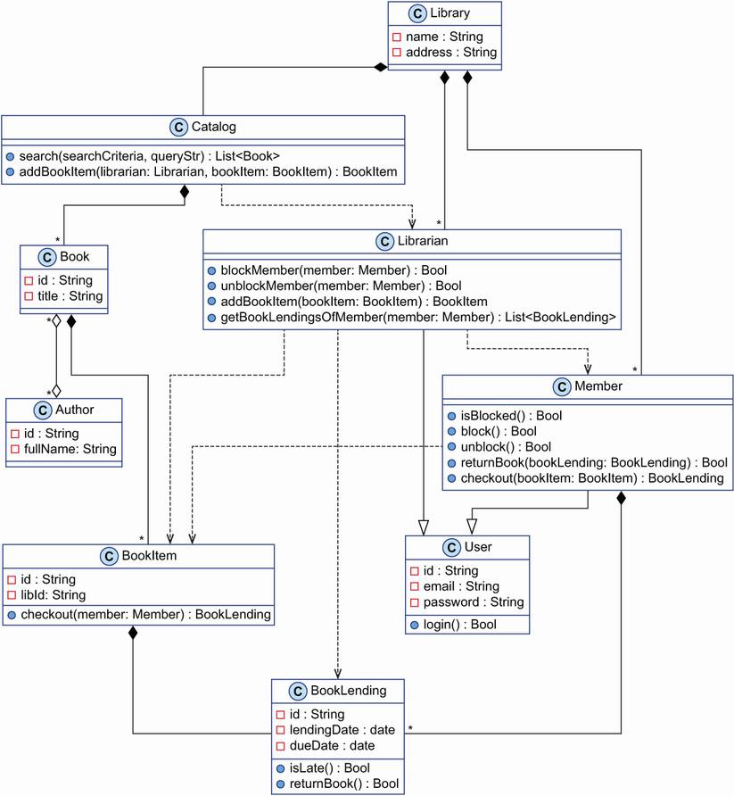

# 1 복잡한 OOP
이번 단원에서는 이런걸 알아본다.
- 시스템을 복잡하게 만드는 OOP
- OOP 시스템은 왜 이해하기 어려운지
- 오브젝트에 코드와 데이터를 섞는 비용

이번 장에서는 OOP가 복잡해지는 이유를 살펴봅니다.
OOP의 구문이나 의미가 프로그램을 복잡하게 만드는게 아닙니다. State와 state를 수정/접근하는 method로 이뤄진 오브젝트들로 프로그램을 짜나가는 근본 방식에서 비롯합니다.

수년간 OOP생태계는 새로운 기능(e.g., anonymous classes, anonymous funcion)을 추가하고 간단한 인터페이스를 제공하는 프레임워크를 개발해 복잡성을 완화시켰습니다. (e.g., Spring ans Jackson in Java)
프레임워크는 내부적으로 reflection, custom annotation과 같은 고급기능에 의존합니다.

이 장에서 OOP 심층 분석을 하자는건 아니다. 다만 OOP 가 프로그램을 복잡하게 만드는 패러다임이라는 걸 알리고자한다. 이로 인해 복잡도를 줄이는 다른 패러다임에 관심이 간다면 다행이겠다. 이 패러다임을 우리는 데이터지향프로그래밍(DOP)라 한다.

## 1.1 OOP 디자인: Classic or classical?
- NOTE: 테오, 낸시, 걔네들이 하는 신규 프로젝트를 part 1 도입부에서 소개했다. 안 읽고 왔으면 보고 오시길

테오는 빡빡한 데드라인을 가진 걸 알았습니다. 불안한 마음을 가진채 낸시의 냅킨을 주머니에 넣고 사무실로 돌아옵니다.
지난 주 그의 상사 모니카는 무슨 일이 있어도 낸시와의 거래를 성사시켜야 한다고 분명히 말했습니다.

Theo가 근무하는 Albatross는 전 세계에 고객을 보유한 소프트웨어 컨설팅 회사입니다.
원래는 스타트업 사이에 고객이 많았습니다. 그러나 지난 1년 동안 많은 프로젝트가 부실하게 관리되었고 스타트업 부서는 고객의 신뢰를 잃었습니다.
그래서 경영진은 테오를 엔터프라이즈 부서에서 스타트업 부서 테크 리더로 이동했습니다.
그의 업무는 거래를 성사시키고 제시간에 납품하는 것입니다.

### 1.1.1 디자인 단계

테오는 코드짜러 달려들기 전에 종이 몇장에 클라핌 프로토타입의 UML 클래스 다이어그램을 그리기 시작했다. 테오는 OOP 프로그래머이기에 모든 비지니스 엔티티는 오브젝트여야 하고 클래스로 이들을 생성해야 한다는데 의심의 여지가 없었다.

클라핌 프로로타입의 요구사항이다.
- 유저는 도서관 멤버과 사서 두 부류다.
- 유저는 이메일과 패스워드로 로그인한다.
- 멤버는 책을 빌릴 수 있다.
- 멤버와 사서는 책제목, 저자로 책을 검색할 수 있다.
- 사서는 멤버가 책을 반납하지 않을 때 차단하거나 해제할 수 있다. 
- 사서는 멤버가 빌려간 책을 나열할 수 있다.
- 단일 도서에 여러 권 있을 수 있다.
- 한 책은 한 개의 실물 도서관에 속한다.

테오는 시스템 구조를 생각하는데 시간을 들여서 전 지구적 클라핌 도서 관리 시스템의 아래의 메인 클래스들을 도출해냈다.

- Library: 시스템 디자인의 핵심 
- Book: 도서
- BookItem: 한 도서가 여러 카피가 있을 수 있고, 한 카피가 한 아이템에 대응 
- BookLending: 대여해가면 lent, 도서 오브젝트가 만들어지면 lending
- Member: 멤버
- Librarian: 사서
- User: 사서와 멤버의 base class
- Catalog: 책 리스트를 들고 있음
- Author: 저자

여기까진 여러울게 없었고 이제 어려운 부분이다. 클래스간 관계를 알아내는 일이다. 두 시간이 지나고 아래같은 범지구적 도서 관리 시스템에 대한 디자인 초안을 들고 나타났다.

- NOTE: 제시된 디자인은 가장 스마트한 OOP 디자인을 나타내지 않습니다. 숙련된 OOP 개발자는 아마도 몇가지 디자인 패턴을 사용해 더 나은 디자인을 제안할 수 있을 것입니다.
	이 디자인은 나이브하고 시스템의 모든 기능을 커버하지 않습니다. 이것은 두가지 의도를 가지고 있습니다.
	- For Theo: 개발자인 Theo에겐 코딩을 시작할 수 있을만큼 충분합니다.
	- For Me: 이 책의 저자인 저에게는 전형적인 OOP시스템의 복잡성을 나타내기에 충분합니다.

Theo는 자신이 디자인한 다이어그램에 대한 자부심을 가지고 있습니다. 그는 커피한잔을 받을 자격이 충분합니다!

커피 머신 근처에서 Theo는 몇 주 전에 Albatross에 합류한 주니어 소프트웨어 개발자 Dave를 만납니다.
Dave의 호기심은 Theo에게 도전적인 질문을 하도록 이끌어주기 때문에 서로 감사하고 있습니다.
커피 머신 근처의 회의는 종종 프로그래밍에 대한 흥미로운 토론으로 바뀝니다.

> 테오: 와썹
> 
> 데이브: 버그눈물줄줄! 오브젝트 스테이트가 계속 바뀌는 이유를 모르겠네. 알아내겠지뭐. 너는?
> 
> 테오: 새고객 시스템 디자인 마침
> 
> 데이브: 쩔 함 봐도됨? 디자인 노하우좀 알게
> 
> 테오: 자리로가서 다이어그램리뷰 고고

### 1.1.2 UML 101

... 잡소리...

> 데이브: 자세히도 그렸네
> 
> 테오: 가슴웅장
> 
> 데이브: 화살표 뭔소리더라
> 
> 테오: Composition, association, inheritance, usage 4개 화살표 씀
> 
> 데이브: composition, association 차이가 뭐임
> 
> 테오: 다른 녀석이랑 같이 살수 있냐 없냐지. composition은 운명공동체임. association은 각자도생.

다이아몬드 화살표 / 다이아몬드 화살표 반대편 스타
- Library가 Catalog를 소유 - 1-1composition, library 죽으면 catalog도 죽는다
- Library가 Member들을 소유 - 1-many composition, library 죽으면 관련 member들 죽는다

> 데이브: aoosication 관계도 있음?
> 
> 테오: 책이랑 저자. 빈다이아몬드 양쪽으로

> 데이브: 점선은 뭐임
> 
> 테오: Method coller/collee 관계

> 데이브: 실선에 빈 삼각형은 상족인가
> 
> 테오: ㅇㅇ

